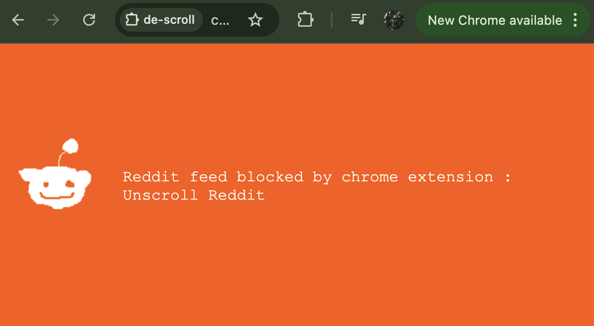
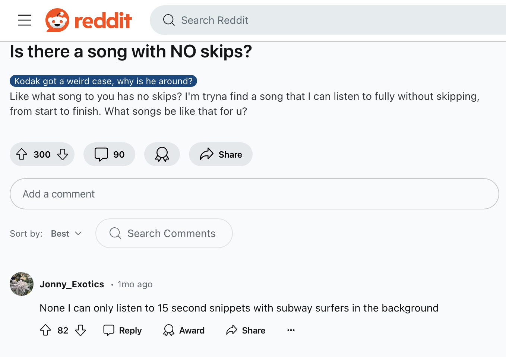

# Unscroll Reddit
Unscroll Reddit: No more scrolling from reddit

Automatically blocks subreddit pages, but does not block discussion threads.

You have a question for reddit? Google it and safely click on any thread.

## subreddit feeds are blocked

## discussion threads are unblocked

## Toggle On/Off with Popup button mouseclick

orange = on, grey = off. Click logo to toggle.

## Whitelist/Blacklist options

Whitelist allows access to subreddit when Unscroll is on.
Blacklist bans discussion threads when Unscroll is on. 

## Good luck
 ?